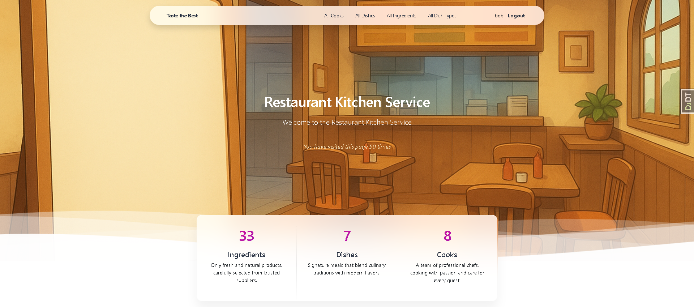
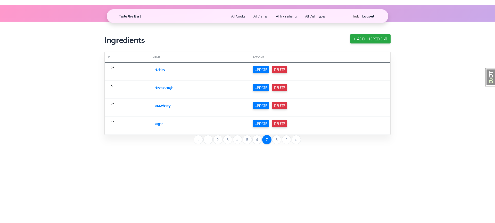

<div align="center">
  
</div>

# Restaurant Kitchen Service

Django project for managing dishes, dish types and ingredients in Restaurant.

- **Effortless Dish Management** – Add, edit, delete and categorize dishes
- **Quick Filtering** – Sort dishes by dish type for better menu planning

# Check it out
#### [Kitchen project deployed to Render](https://restaurant-kitchen-service-njiu.onrender.com)

## Login
* ###### login: user

* ###### password: user123456

## Installation 

Python3 must be already installed 

```shell
git clone https://github.com/iivitalik/restaurant-kitchen-service.git
cd restaurant-kitchen-service
python3 -m venv venv
source venv/bin/activate  # On Windows use `venv\Scripts\activate`
pip install -r requirements.txt
python manage.py runserver
```

## Features

* Authentication functionality for Cook/User
* Managing dishes, dish types and ingredients
* Powerful admin panel for advanced managing

## Demo


